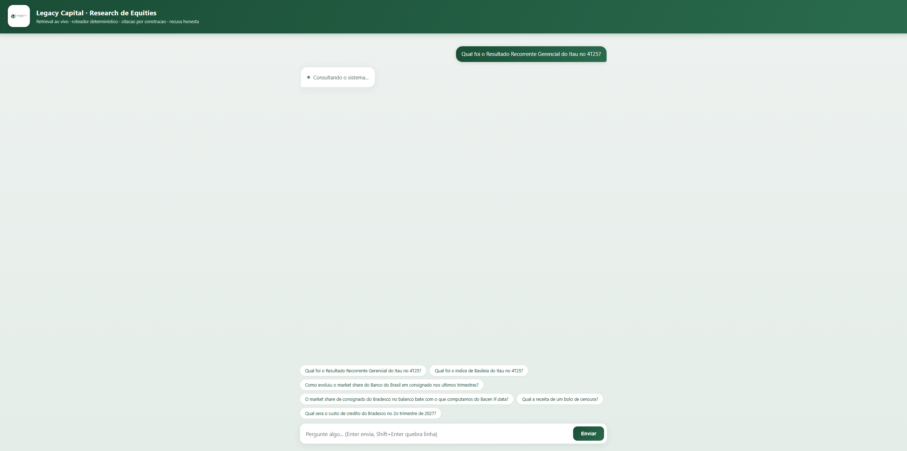

# Legacy — Sistema de Retrieval para Research de Equities

> Case de estágio AI · **Legacy Capital — Equities Team**

Fundação **genérica** de retrieval para pesquisa de equities: uma base **ligada e auto-alimentada**
(ingestão direto da fonte, sem upload manual) que lida tanto com **texto** (earnings releases,
transcrições, notícias) quanto com **dados estruturados** (séries do Banco Central, financials), e
que foi **provada a fundo** num fio condutor — bancos brasileiros, crédito **consignado**.

**Duas regras inegociáveis (garantidas por construção, não por sorte do prompt):**
1. Toda resposta **cita a fonte** — a citação é anexada **por código**, a partir dos trechos que
   embasaram a resposta; não dependemos de o LLM lembrar de citar.
2. A resposta vem **estritamente da base** — se a informação não está lá, o sistema responde
   *"não disponível na base"* (com o **motivo**) em vez de alucinar.

---

## TL;DR — em 2 minutos ⏱️

**Sistema de retrieval *dual-path* para research de equities.** A sacada que organiza tudo: **separar
texto de número** — texto se **recupera e cita**; número se **computa em SQL** (o LLM **nunca** faz a
conta). Por isso o número é **exato e auditável**, e o sistema **recusa em vez de inventar**.

| retrieval — hit@3 | recusa por escopo | fidelidade (juiz independente) | alucinação |
|:---:|:---:|:---:|:---:|
| **90%** realista · 81,8% completo · MRR **0,686** | **12/12** · over-recusa **0%** | **6/6** sustentadas | **0** |

> **Corpus provado a fundo, não largo (escolha assumida):** 11 documentos reais — 5 fontes, 4 tipos,
> de **312 pp a 4 pp**, multi-período — + Bacen IF.data (10 trimestres). Escalar p/ **500+** é
> *acrescentar linhas ao manifesto*; o gargalo é índice/dedup, **não** o pipeline (ver *Fraquezas e escala*).

### Ver funcionando em 30 segundos

> O case diz, com razão, que **o backend é o que importa** (UI não é avaliada). O chat abaixo é só a
> **janela** mais rápida pra ver os quatro caminhos num lugar só:

```bat
set KMP_DUPLICATE_LIB_OK=TRUE & set PYTHONPATH=. & set PYTHONIOENCODING=utf-8
python scripts\ui_demo.py        :: abra http://localhost:8000
```



**Cole estas quatro perguntas** — cada uma exercita um caminho diferente (o roteador ignora acento e maiúscula):

| pergunta | caminho | o que prova |
|---|---|---|
| *Qual foi o Resultado Recorrente Gerencial do Itaú no 4T25?* | **texto** | acha e cita **R$ 12,3 bi** (pág. 8) num corpus multi-período |
| *Qual o market share do Nubank em cartão de crédito, segundo o IF.data?* | **número genérico** | série computada em SQL — **qualquer banco × modalidade**, não só consignado |
| *O market share de consignado do Bradesco no balanço bate com o que computamos do Bacen?* | **multi-fonte** | **declarado** (texto) × **computado** (Bacen), lado a lado |
| *Qual será o custo de crédito do Bradesco no 2º trimestre de 2027?* | **recusa** | fora da base (futuro) → diz o **motivo**, não inventa |

---

## Abordagem em uma frase

**Não é RAG ingênuo.** É um **sistema dual-path roteado**:

- **Caminho de texto** → busca **híbrida** (densa BGE-M3 + BM25) fundida por **RRF** + **filtro de
  metadados** (entidade, período, tipo de doc) + **rerank** (cross-encoder).
- **Caminho estruturado** → **store SQL** (DuckDB) para números e séries, com o **cálculo feito em
  código/SQL** (não pelo LLM) — auditável por re-execução.
- **Roteador determinístico** (regras, **não** um agente LLM aberto) decide o caminho e une os dois.
- **Citação e recusa** garantidas por construção.

**Por que o caminho estruturado** (e não jogar tudo no LLM): o gargalo é a **recuperação**, não a
aritmética. (1) Agregação derrota o top-k; (2) embeddings são **cegos a magnitude numérica**; (3)
número computado em código é **auditável e citável**. O racional completo, as alternativas
rejeitadas (RAG ingênuo, long-context, fine-tuning, GraphRAG) e as **evidências verificadas
adversarialmente** estão em [`docs/decisions/0001-arquitetura-dual-path.md`](docs/decisions/0001-arquitetura-dual-path.md)
e [`docs/pesquisa/evidencias-verificadas.md`](docs/pesquisa/evidencias-verificadas.md).

---

## Resultados do eval

> *"Comece pelo eval."* Medimos antes de otimizar. Saídas **reproduzíveis** (com comandos) em
> [`docs/resultados-eval.md`](docs/resultados-eval.md). Corpus de **texto** = **11 documentos** de
> **5 fontes** (Itaú, Bradesco, BB, Santander, Bacen), **4 tipos** (release, transcrição, sumário,
> nota), **longo × curto** (de 312 pp a 4 pp) e **multi-período** (3T25/4T25/1T26) — **3.650 fichas**,
> alimentadas por um **manifesto** (ver *Como a base é alimentada*); números = **Bacen IF.data,
> 10 trimestres (3T23–4T25)**.

**1) Qualidade de retrieval — hit@k / MRR (BGE-M3 + reranker reais).** Gold por **página**, curado
por busca **lexical + leitura** (independente do embedding → anti-circular). **22 sondagens** em
**5 fontes (4 bancos + Bacen) e 4 tipos** de documento, com **retrieval ciente de período** (quando a pergunta nomeia o
trimestre, um filtro de metadados fixa o documento certo no corpus multi-período):

| conjunto | hit@1 | hit@3 | hit@5 | MRR |
|---|---|---|---|---|
| **sondagens realistas** (sem gíria/paráfrase) | — | **90%** | — | — |
| **22 sondagens** (inclui 2 limite + transcrição/nota) | 54,5% | 81,8% | 86,4% | **0,686** |

**Limites honestos** (não escondidos): a gíria *"calote"* e a paráfrase *"descontado direto da folha"*
falham de propósito; a transcrição de *política de crédito* perde para o release formal (**embora** a de
*inadimplência 90d* acerte no top-3); e o *consignado do Santander* aparece só no hit@5 (ver *Fraquezas*).
Com o **filtro de período** (remove a competição 4T25/3T25/1T26), **7 das 8** sondagens realistas do Itaú
ficam em **rank 1** — incl. o RRG de 1T26 e 3T25 (mesmo banco, trimestres quase idênticos).

**2) Recusa por escopo — Estágio 1 (roteador determinístico, sem modelo).** 12 perguntas, 3
categorias de comportamento + 1 distrator anti-over-recusa:

| métrica | valor |
|---|---|
| acurácia de comportamento | **12/12** |
| recusa correta (dos que deviam recusar) | **100%** |
| over-recusa (recusou um respondível) | **0%** |
| alucinação (respondeu o que devia recusar) | **0** |

**3) Fidelidade da resposta — faithfulness (juiz LLM INDEPENDENTE, Groq temp 0).** Nas respostas
geradas (texto, **4 bancos**): **6/6 inteiramente sustentadas** pelo contexto citado — e o juiz é um
**modelo de família diferente** do gerador (`openai/gpt-oss-120b` ≠ Llama 3.3 70B → **sem viés de
auto-avaliação**). 2 perguntas foram **corretamente recusadas** (guidance ausente no contexto; share
do Bradesco numa célula de tabela) — defesa em profundidade. Ressalva: `n=6` é sanidade forte.

**3b) Calibração do gate de evidência — Estágio 2.** O limiar deixou de ser placeholder: varrendo um
mini-gold (6 respondíveis × 6 fora-da-base), as respondíveis pontuam **~0,72** e as fora-da-base
**~0,50**, com **joelho em 0,60** (0% over-recusa, 0% vazamento). O antigo **0,30 deixava 100% das
fora-da-base passarem** — agora a *"receita de bolo"* é barrada **pelo gate**, não só pelo LLM.
`LIMIAR_EVIDENCIA_PADRAO` foi ajustado **0,30 → 0,60** com esse lastro.

**4) Resolução do Caso B — ponta a ponta (modelos reais, incl. Groq/Llama 3.3 70B).** As 3
categorias resolvidas ao vivo: *lucro Itaú 4T25* **R$ 12,3 bi** (pág. 8); *consignado Itaú 4T25*
**R$ 75,3 bi** (pág. 21); *market share BB consignado* **19,9% → 19,2%** (série trimestral 3T23→4T25,
IF.data, SQL — e o caminho é **genérico**: *Nubank em cartão* **11,1% → 14,9%**, qualquer banco ×
modalidade, e **compara 2+ bancos por janela escolhida** (cross-bank **ciente de período**, alinhado
pelo trimestre comum e com o gap **quantificado** — ex.: *de 2023→2024 o BB ganhou **+0,7 p.p. a mais**
que o Bradesco; de 2024→2025 ambos caíram e o Bradesco **perdeu menos**, +0,4 p.p. à frente*));
recusas **R1** (futuro 2027) e **R2** (Nubank IFRS × Itaú Cosif).

**5) Caso B3 ao vivo — DECLARADO × COMPUTADO (caminho `multi_fonte`).** O sistema cruza o que o
**Bradesco declara** — agora incluindo a **fala do CEO na teleconferência 3T25** (*"market share de
~14,2%; INSS 15,4%, público 14,3%, privado 7,5%"*, recuperada da **transcrição**) e a tabela do release
4T25 (**14,1%**) — com o que **computamos** do Bacen (**13,8%** no 4T25, SQL) → **confirma**. Quando o
LLM hesita diante de cifras próximas em tabelas cruas, o orquestrador **cai para as evidências citadas
lado a lado** (não inventa, não recusa). Saídas completas em [`docs/resultados-eval.md`](docs/resultados-eval.md).

> **Honestidade estatística:** os `n` são pequenos (escopo `n=12`, fidelidade `n=6`, calibração do
> gate `n=12`) — **sanidade forte, não estatística de população**. O gate **foi calibrado** e o juiz
> de fidelidade **agora é independente** (antes ambos pendentes); o que segue aberto está em
> *Fraquezas* e [ADR-0005](docs/decisions/0005-robustez-escala-calibracao.md).

---

## Arquitetura

```
                          pergunta
                             │
                    ┌────────▼─────────┐
                    │  ROTEADOR (regras)│  Estágio 1: escopo + caminho
                    └────────┬─────────┘
        ┌─────────────┬──────┴───────┬──────────────────┐
        ▼             ▼              ▼                  ▼
  não_respondível  doc_unico      computada         multi_fonte
   (recusa por    (texto:        (números:          (cruza
    escopo,        híbrido+       market share        DECLARADO no
    com motivo)    rerank +       em SQL,             texto  ×
                   gate de        determinístico,     COMPUTADO no
                   evidência →    auditável)          IF.data; LLM
                   LLM redige)                        reconcilia)
                        │
                  Estágio 2: nota do reranker < limiar → recusa
                        │
                  citação ESTRUTURAL anexada por código (dedup)
```

**Recusa em dois estágios, por responsabilidades separadas:**
- **Estágio 1 — escopo** (roteador): pergunta fora da cobertura → recusa *antes* de buscar. Três
  portões: **R1** (período no futuro além de 2026), **R2** (cruza bases contábeis incompatíveis —
  IFRS × Cosif — como **conjunção** de sinais, **nunca** pelo nome do banco), **R3** (pede frase
  *verbatim* que não existe na base).
- **Estágio 2 — evidência** (gate): mesmo no escopo, se a melhor nota do reranker fica **abaixo do
  limiar** (**0,60**, calibrado — ver *Resultados*), recusa em vez de redigir sobre evidência fraca.

**Roteador determinístico** (e não agente LLM aberto) é uma escolha de projeto deliberada: como o
eval pesa **50%** da nota e roda o sistema repetidamente, *mesma pergunta → mesmo caminho* mantém a
avaliação **reprodutível e auditável**. O preço (fragilidade léxica) é assumido e **medido** no eval.

---

## Decisões de chunking

- **Página = fronteira de chunk e âncora de citação.** Uma ficha **nunca cruza páginas** — assim a
  citação aponta para uma página real do documento. (`legacy_rag/index/chunking.py`)
- **~1200 caracteres por ficha, ~200 de sobreposição**, quebrando em **fim de frase / quebra de
  linha** — nunca no meio de uma unidade. (constantes `ALVO_CHARS=1200`, `OVERLAP_CHARS=200`)
- **Duas formas por ficha:** `.indexavel` = cabeçalho de metadados (`banco | período | tipo |
  página`) + trecho, que vai para o **embedding** (dá contexto à busca); `.texto` = trecho cru, que é
  o que se **cita**.
- **Dado estruturado NÃO é "chunkado" — é a outra metade do *dual-path*.** Número não se recupera por
  similaridade (ADR-0001): a carteira do Bacen entra como **linhas numa tabela DuckDB** (banco ×
  período × modalidade) e o market share é **calculado em SQL na hora da pergunta** — não vira texto,
  não passa por embedding. Texto é chunkado e citado **por página**; número é computado e citado **pela
  fonte + a query**. Assim documento longo, documento curto e série numérica vão cada um pelo caminho certo.

---

## Como a base é alimentada (ligada / automática)

Critério nº 1 do case. **Sem upload manual** — o sistema busca na fonte e indexa sozinho:

- **Texto (releases/transcrições/notas):** um **manifesto** (`corpus/manifesto.yaml`) lista as fontes
  e `scripts/ingerir_corpus.py` abastece a base **sozinho** — baixa, extrai por página, chunka, embeda
  (BGE-M3) e persiste — **idempotente por (banco, período, tipo_doc)** e com `try/except` por documento
  (uma fonte que cai não derruba o lote). `baixar(url)` traz os **bytes do PDF** com **retry/backoff**
  do CDN/`api.mziq.com` (a página de RI dá **403** a robô; o backend do mziq **não**) ou direto do
  Bacen. `extrair_paginas` (pypdf) devolve uma string **por página** — a âncora da citação.
- **Números (carteira por modalidade + cadastro):** API **Olinda IF.data** do Banco Central. A
  carteira PF por modalidade vem em `Relatório=11`; o **cadastro** mapeia cada instituição →
  **conglomerado prudencial**, e o market share é agregado **por conglomerado** (soma os vários CNPJs
  de um mesmo banco) — divisão `carteira_banco / Σ sistema` feita **em SQL**, idempotente por período.
- **Lida com a quebra do IF.data em 2025** (Res. 4.966/IFRS9): a carteira por modalidade **migrou de
  `TipoInstituicao=2` (≤2024) para `TipoInstituicao=1` (≥2025)** — e nesse nível o código já é o
  conglomerado prudencial. O cliente **escolhe o nível pelo período**, **pagina** as respostas grandes
  (com dedup das linhas que a API ecoa), e **nunca apaga dados** numa queda da fonte (preserva o
  existente). Resultado: série de consignado **contínua e sem salto** de 3T23 a 4T25.

> A base de **texto** tem **11 documentos** (Itaú 4T25/3T25/1T26, Bradesco 4T25/3T25 + transcrição,
> BB 4T25 + sumário, Santander 4T25, 2 notas do Bacen; **3.650 fichas**) e a de **números**,
> **10 trimestres (3T23–4T25)**. Crescer para 500+ é **acrescentar linhas ao manifesto**; o que falta
> para essa escala (dedup por **hash de conteúdo**, índice **HNSW**, embedding incremental) está em
> *Fraquezas e escala*.

---

## Como rodar

Stack **100% open/free**, sem chave paga no caminho crítico — ver [ADR-0003](docs/decisions/0003-stack-open-free.md). Python ≥ 3.11.

```bat
python -m venv .venv && .venv\Scripts\activate
pip install -r requirements.txt
copy .env.example .env          :: opcional: LLM_PROVIDER=groq_free + GROQ_API_KEY p/ a síntese

:: no Windows, prefixe os scripts pesados com estas 3 variáveis (carrega torch sem conflito de OpenMP):
set KMP_DUPLICATE_LIB_OK=TRUE & set PYTHONPATH=. & set PYTHONIOENCODING=utf-8

python -m pytest -q                      :: 181 testes — sem rede, sem torch, sem chave (fakes)
python -m legacy_rag.eval.runner         :: matriz de recusa-por-escopo (sem modelo)
python scripts\atualizar_base.py         :: UM comando: liga a base (numeros + texto, idempotente) + valida periodos
python scripts\atualizar_base.py --de 2024T1 --ate 2025T4          :: escolhe a JANELA de trimestres dos numeros
python scripts\atualizar_base.py --de 2024T1 --ate 2025T4 --dry-run :: so PREVE (nao baixa, nao grava)
::  ^ (chama os dois abaixo; rode-os direto se quiser so um lado)
python scripts\ingerir_numeros.py        :: alimenta carteira_pf + cadastro (Bacen IF.data; aceita --de/--ate)
python scripts\ingerir_corpus.py         :: alimenta a base de TEXTO pelo manifesto (11 docs, 5 fontes)
python scripts\eval_retrieval_real.py    :: hit@k / MRR reais (ciente de período)
python scripts\calibrar_gate.py          :: calibra o limiar do gate (over-recusa × vazamento → joelho)
python scripts\eval_fidelidade_real.py   :: faithfulness com juiz INDEPENDENTE (Groq)
python scripts\resolver_caso.py          :: resolve o Caso B ponta a ponta (LLM real, se .env tiver chave)
python scripts\perguntar.py "..."        :: pergunta LIVRE: mostra a rota + resposta citada ou recusa
python scripts\ui_demo.py                :: UI de demo local (http://localhost:8000) — extra p/ apresentação
```

Os **181 testes** rodam em segundos e provam o **fluxo e as recusas** com modelos **falsos** (encoder/
reranker/LLM injetáveis) — sem baixar nada. A **qualidade semântica** entra com os modelos reais nos
scripts. O LLM fica atrás de uma interface trocável (`LLMClient`): o provedor ativo é **Groq
(Llama 3.3 70B)**, selecionável por `LLM_PROVIDER` no `.env`; sem chave, o sistema ainda roteia,
recupera, computa números e recusa — só não redige o texto livre.

---

## Estrutura do repositório

```
legacy_rag/
  config.py            núcleo de bancos, modalidade, modelos, limiares
  env.py               carregador minimalista de .env (ambiente tem precedência)
  ingestion/           base auto-alimentada: baixar release (CDN) → orquestra baixar→chunk→embed→store
  index/               chunking (página=âncora) · embeddings (BGE-M3, interface trocável) · store de texto (DuckDB)
  retrieval/           vetorial (cosseno) · lexical (BM25) · híbrido (RRF) · rerank (cross-encoder)
  structured/          Bacen IF.data · market share por conglomerado (SQL) · store DuckDB
  router/              roteador determinístico (escopo R1/R2/R3/R7 + caminho)
  generation/          gate de evidência · geração com citação estrutural · LLMClient (Groq)
  pipeline.py          orquestrador: pergunta → resposta citada ou recusa explicada
  runtime.py           fábrica única das dependências reais (modelos + DuckDB + LLM) p/ CLI e UI de demo
  eval/                métricas · eval de retrieval · runner de escopo · calibração do gate · faithfulness
corpus/
  manifesto.yaml       fontes da base de TEXTO (banco/período/tipo/url) — a "base ligada", reproduzível
eval/
  questions.yaml       12 perguntas (3 categorias de comportamento + 1 distrator + 1 B2 de tom)
  retrieval_gold.yaml  22 sondagens (gold por página; 5 fontes, 4 tipos; 2 limite de propósito)
  gate_gold.yaml       mini-gold da calibração do gate (respondíveis × fora-da-base)
docs/
  decisions/           ADRs 0001–0005 — a "progressão de raciocínio" que o case pede
  conceitos/           5 docs didáticos (RAG, embeddings, BM25/híbrida, números/SQL, arquitetura do código)
  pesquisa/            fact-check adversarial das afirmações técnicas
  resultados-eval.md   saídas reproduzíveis do eval (lastro dos números deste README)
scripts/               ingerir_numeros · ingerir_corpus · ingerir_bradesco · prova_retrieval_real · eval_retrieval_real · calibrar_gate · calibrar_discrimina_rerank · eval_fidelidade_real · resolver_caso · resolver_b3 · perguntar · ui_demo
tests/                 23 arquivos · 181 testes
```

---

## Fraquezas e o que faria diferente em escala

Documentado com honestidade — é o que o case pede. **Vários itens antes "abertos" viraram código
medido** (ver [ADR-0005](docs/decisions/0005-robustez-escala-calibracao.md)); o que sobra está nomeado.

- **Corpus em dezenas, não centenas:** 11 documentos (5 fontes, 4 tipos, longo × curto, multi-período)
  — provam retrieval heterogêneo, eval e o B3, mas ainda longe dos 500+. Crescer é **acrescentar linhas
  ao manifesto** (`corpus/manifesto.yaml`); o gargalo de escala é índice + dedup (abaixo), não o pipeline.
- **Busca exata, sem índice aproximado:** vetorial é **cosseno brute-force** e o BM25 é reconstruído
  em memória por consulta — **exato e instantâneo abaixo de ~100k fichas** (temos 3.650; nesse regime,
  força bruta *vence* o índice aproximado, que pode errar o vizinho mais próximo). Acima disso, a migração
  é **in-place no próprio DuckDB**: a extensão **VSS** liga um índice **HNSW** (lib `usearch`) no **mesmo
  arquivo**, com um `CREATE INDEX` — **sem trocar de sistema nem mover dados** para um vector DB externo.
  Projetado, não construído (sem benchmark medido aqui).
- **Retrieval ciente de período exige o período na pergunta:** com 3 períodos do mesmo banco, uma
  pergunta *period-ambígua* faz a página de um trimestre competir com a do outro. O filtro de metadados
  resolve **quando a pergunta nomeia o trimestre** ("4T25"); sem período, fica à mercê do ranqueamento.
  Fix futuro: inferir o trimestre "mais recente" como default, ou desambiguar com o usuário.
- **Transcrição é irregular (não some):** a sondagem de *política de crédito* na teleconferência do
  Bradesco falha (a busca prefere o release **formal** à fala conversacional), **mas** a de *inadimplência
  90d* (também transcrição) acerta no top-3 — depende do quão "verbatim" é o trecho. Fix: peso por
  `tipo_doc` quando a pergunta o pede ("na teleconferência").
- **Gate calibrado num gold pequeno:** o limiar **0,60** veio de varrer um mini-gold (joelho com 0%
  over-recusa / 0% vazamento), mas `n=12`; produção pede um gold maior e idealmente por-modalidade.
- **Fallback do reranker é heurístico:** caímos para a ordem do RRF quando o desvio-padrão das notas
  fica < 0,05. Esse limiar do "não-discrimina" foi escolhido por inspeção, não calibrado.
- **Interação fallback × gate (over-recusa em gíria/paráfrase):** quando o cross-encoder achata as notas
  (~0,50), o fallback recupera a **ordem** do RRF, mas as **notas** continuam achatadas; como o gate de
  evidência exige ≥ 0,60, uma pergunta **respondível porém difícil** (gíria/paráfrase) pode ser recusada
  mesmo com o trecho certo no topo. É a mesma família dos limites de gíria já declarados; o fix honesto é
  ampliar o `gate_gold.yaml` com casos "difícil-mas-respondível" e **recalibrar** (não feito: mexer no
  0,60 às vésperas arrisca vazamento). Achado da auditoria adversarial (ADR-0005).
- **Modalidade é por palavra-chave (determinística), com 3 guardas de honestidade:** *(A)* sinônimos
  coloquiais (*"carro"*→veículos, *"casa própria"*→habitação); *(B)* se a pergunta **não nomeia** o
  produto, a resposta **avisa** que assumiu consignado (sem default **silencioso**); *(C)* **R7** recusa o
  *número* de um sub-recorte fora dos 7 baldes do IF.data (*consignado INSS*, *cheque especial*, *SFH*) —
  aponta a modalidade-pai (SQL) ou o release (texto). **Limite residual:** um sinônimo fora da lista ainda
  cai no default — mas agora **avisado**, não silencioso (ver ADR-0005, item 14).
- **RAG sobre tabelas:** o número *declarado* do B3 (consignado **14,1%**) vive numa **célula de
  tabela**; ao chunkar, perde cabeçalho/unidade e o LLM (corretamente) não o lê. Quando uma tabela densa
  estoura o tamanho-alvo e quebra em 2+ fichas, as fichas de continuação ficam **sem a linha de cabeçalho
  de colunas** (o overlap só carrega a última linha de dado) — a auditoria confirmou. Hoje o `multi_fonte`
  cai para evidência citada lado a lado; o fix real é **chunking ciente de tabela** (re-prefixar o cabeçalho).
  É por isso que o share *computado* vai pelo **caminho SQL**, não pelo texto.
- **Lacunas do roteador (R4/R6):** distinguir *realizado* de *guidance* dentro de 2026 (R4) e métricas
  ainda não ingeridas (R6) caem hoje no Estágio 2 (gate), não numa regra dedicada.
- **Dedup só por (banco, período, tipo_doc):** falta dedup por **hash de conteúdo** para reingestão em
  escala (mesmo arquivo, URL diferente) — projetado, não construído.
- **Faithfulness em n pequeno:** já com **juiz independente** (gpt-oss-120b ≠ gerador) e `n=6` em 4
  bancos (6/6); ainda assim é amostra pequena — produção pede `n` maior e mais bancos/períodos.

---

## Decisões (ADRs) — a progressão de raciocínio

| ADR | Decisão |
|---|---|
| [0001](docs/decisions/0001-arquitetura-dual-path.md) | Arquitetura **dual-path roteada** (não RAG ingênuo) |
| [0002](docs/decisions/0002-fio-condutor-caso-b-consignado.md) | Fio condutor **Caso B · consignado · BB+Bradesco+Itaú** (Nubank = não-respondível orgânico) |
| [0003](docs/decisions/0003-stack-open-free.md) | Stack **100% open/free**; LLM atrás de interface trocável |
| [0004](docs/decisions/0004-ingestao-larga-prova-focada.md) | **Ingestão larga, prova focada** |
| [0005](docs/decisions/0005-robustez-escala-calibracao.md) | **Robustez, escala e calibração**: manifesto + fallback do reranker + calibração do gate + juiz independente |

---

## Nota sobre uso de IA

Construído com apoio de IA (Claude), conforme **permitido e encorajado** pelo case. Toda decisão está
documentada em `docs/decisions/` e é defensável — incluindo um passo de **verificação adversarial**
das afirmações técnicas (`docs/pesquisa/`) e uma **auditoria automatizada do próprio código** antes de
escrever este README, para que nenhuma afirmação aqui ultrapasse o que o código realmente faz.
